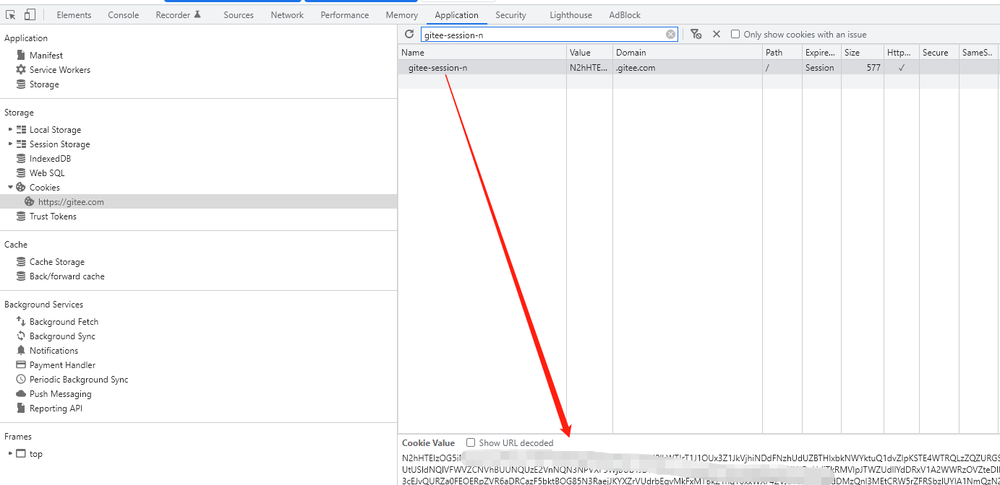

# rusgit

## 介绍

一个加速Github拉取的工具，原理基于Gitee的镜像Repo。**Rusgit**表示用Rust开发的Git工具。

## 示例


## 使用

1. 登陆Gitee, 然后从浏览器中获取登陆态Session (Gitee的[check_project_duplicate][1]接口需要)



2. 设置环境变量

linux&mac
```bash
export GITEE_SESSION="QjlHSTdMUWJEWE1KMWkvY1.....0712"
```

powershell
```powershell
$env:GITEE_SESSION="QjlHSTdMUWJEWE1KMWkvY1.....0712"
```

*QjlHSTdMUWJEWE1KMWkvY1.....0712*替换成第一步获取到的gitee-session-n的值

3. Clone

```bash
rusgit clone https://github.com/ClickHouse/ClickHouse.git
```

4. Submodule

```bash
cd ClickHouse
rusgit submodule init
rusgit submodule update #或git submodule update
```

[1]: https://gitee.com/projects/check_project_duplicate?import_url=https://github.com/xbugliu/rusgit.git
