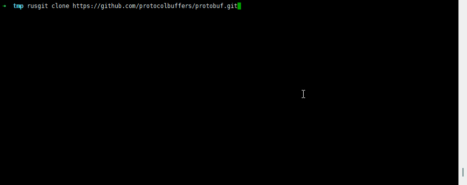
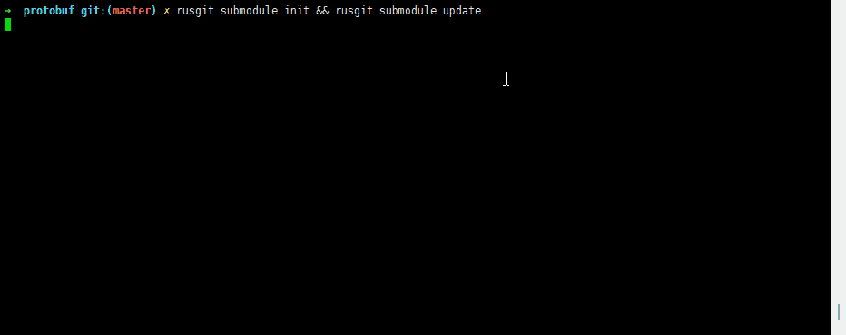

# rusgit

## 介绍

一个加速Github拉取的工具，原理基于Gitee的镜像Repo。**rusgit**表示用Rust开发的Git工具。

## 示例





## 使用

0. 下载

linux
```
~ wget https://github.com/xbugliu/rusgit/releases/download/0.5.4/rusgit_0.5.4_x86_64-unknown-linux-musl.tar.gz
~ tar -zxvf rusgit_0.5.4_x86_64-unknown-linux-musl.tar.gz
~ export PATH=$PATH:$PWD

```

1. 登陆Gitee, 然后从浏览器中获取登陆态Session (Gitee的[check_project_duplicate][1]接口需要)


2. 设置环境变量

linux&mac
```bash
export GITEE_SESSION="your-gitee-session-n"
```

powershell
```powershell
$env:GITEE_SESSION="your-gitee-session-n"
```

*your-gitee-session-n*替换成第一步获取到的gitee-session-n的值

3. Clone

```bash
rusgit clone https://github.com/ClickHouse/ClickHouse.git
```

4. Submodule

```bash
cd ClickHouse
rusgit submodule init
rusgit submodule update #或git submodule update
```

[1]: https://gitee.com/projects/check_project_duplicate?import_url=https://github.com/xbugliu/rusgit.git
